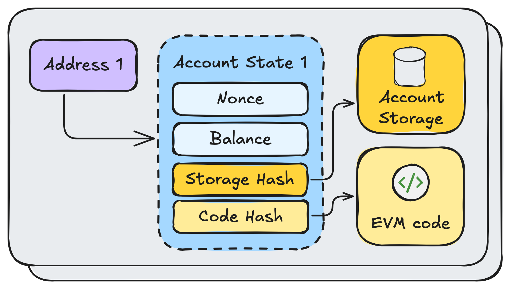

# Complete, step by step guid for BuidlGuidl CTF Challenge
 - [Challenges](#challenges)
 - [RunAndDeploy](#run-project)


This repository contains the solutions for  [BuidlGuidl CTF challenge](https://ctf.buidlguidl.com/).

The challenge tests users' skills in Solidity focusing on security. 

In the following sections I'll describe each challenge and the solution, you can also found the solution codes in this repo.

# Challenges

- [Challenge1](#challenge-1)
- [Challenge2](#challenge-2)
- [Challenge3](#challenge-3)
- [Challenge4](#challenge-4)
- [Challenge5](#challenge-5)
- [Challenge6](#challenge-6)
- [Challenge7](#challenge-7)
- [Challenge8](#challenge-8)
- [Challenge9](#challenge-9)
- [Challenge10](#challenge-10)
- [Challenge11](#challenge-11)
- [Challenge12](#challenge-12)


## Challenge 1

The first challenge only wants users to call registerMe(string memory _name) function of the [challenge 1 contract](https://optimistic.etherscan.io/address/0xfa2Aad507B1Fa963A1fd6F8a491A7088Cd4538A5#code). you need to have a wallet to interact with the network (in this case Optimism), and easily can connect your wallet to the [optimism scan](https://optimistic.etherscan.io/address/0xfa2Aad507B1Fa963A1fd6F8a491A7088Cd4538A5#writeContract) and call the function. 


you can also use other ways to call the function like remix ide, etc. 


## Challenge 2

the requirement of this challenge is msg.sender != tx.origin. 

In Solidity msg.sender is the account calling a function and tx.origin is the account (externally owned account) that initiated the transaction (or function call). 

If a user send a transaction (like a function call) with their wallet then msg.sender = tx.origin. but if a user call a function from contract_1 and in that function, there was a call to another contract (like contract_2), in the function of contract_2, msg.sender would be contract_1, and tx.origin would be the user address. 


[](https://blockchain-academy.hs-mittweida.de/courses/solidity-coding-beginners-to-intermediate/lessons/solidity-5-calling-other-contracts-visibility-state-access/topic/tx-origin-and-msg-sender/)


So you only need to have a contract to call the target contract. A simple contract is created for this purpose can be found at contracts/CtfChallenge2.sol file. 

After deployment and verification of the solution contract for challenge 2 by: 

```
npm run deplpy:op
```

(find deployed contract at deployments/optimism folder)

call 

indirectCall(target_address) functoin and pass challenge2_contract_address as argument. 


## Challenge 3

To pass this challenge you need to have a contract to call the challenge contract just like challenge 2, but with a difference. The contract that calls the challenge contract should not have any code in their storage during the call.  
But how it's possible?!

Before explaining the solution you need to know that in EVM based networks, there are 2 types of accounts, externally owned and internally owned. 
externally owned accounts are wallets and internally owned accounts are smart contracts.

every account has a storage on the network containing nonce, ether balance, code, etc. 
For externally owned accounts there is no code, but for internally owned ones there's some code (so the length of the code is not 0).

[](https://decentralizedsecurity.es/eip-7702-ethereums-next-step-toward-a-more-flexible-account-model)


To pass the requirement of this challenge we need to have a contract (for indirect call), with no code in its storage. its impossible unless during the creation of the contract, since the code is not stored yet.

So we need to call the challenge 3 contract in the constructor of another contract (before storing the code in the solution contract account storage).

you can find the solution at contracts/CtfChallenge3.sol 

you need to deploy contract with challenge3_contract_address as argument to pass this challenge.

```
npm run deploy:op
npm run verify:op
```


## Challenge 4

By checking challenge 4 contract you'll know that you should find the minter address (and secret key), sign a message with a specific format and pass these 2 arguments to the mintFlag(address _minter, bytes memory signature) function to pass this step. 

In the challenge 4 hints, the deploy script is referred (https://github.com/buidlguidl/ctf.buidlguidl.com/blob/main/packages/hardhat/deploy/00_deploy_ctf_contracts.ts#L71). 

```
const hAccounts = hre.config.networks.hardhat.accounts as HardhatNetworkHDAccountsConfig;
  const derivationPath = "m/44'/60'/0'/0/12";
  const challenge4Account = HDNodeWallet.fromMnemonic(Mnemonic.fromPhrase(hAccounts.mnemonic), derivationPath);
```

above code is the responsible for generating the minter address, that we should use to generate a signature by it. 

If you are not using Hardhat (or EthScafold) I highly recommend to use it, since the deploy script is developed in Hardhat. 

The minter address is an HD account with "m/44'/60'/0'/0/12" derivation path and with default mnemonic of Hardhat. 

We do the exact thing like challenge 4 deploy script to find minter address and secret key and then sign the required message. 

The solution is at deploy/004_deploy_ctfchallenge4.ts file.

First we derive the minter address: 

```
const hAccounts = hre.config.networks.hardhat.accounts as HardhatNetworkHDAccountsConfig;
  const derivationPath = "m/44'/60'/0'/0/12";
  const challenge4Account = HDNodeWallet.fromMnemonic(Mnemonic.fromPhrase(hAccounts.mnemonic), derivationPath);

  console.log("Challenge4 account:", challenge4Account);
  console.log("Challenge4 address:", challenge4Account.address);
```

and then sign the message: 

```
const msgSender = deployer; // Or specify, e.g., "0xYourAddressHere"

  // Compute the message hash (equivalent to keccak256(abi.encode("BG CTF Challenge 4", msg.sender)))
  const abiCoder = new ethers.AbiCoder();
  const messageHash = ethers.keccak256(abiCoder.encode(["string", "address"], ["BG CTF Challenge 4", msgSender]));

  // Implement toEthSignedMessageHash equivalent in JavaScript
  const prefix = ethers.toUtf8Bytes("\x19Ethereum Signed Message:\n32"); // Prefix as bytes
  const combined = ethers.concat([prefix, ethers.getBytes(messageHash)]); // Concatenate prefix and messageHash
//   const ethSignedMessageHash = ethers.keccak256(combined); // keccak256(prefix + messageHash)
  const ethSignedMessageHash =  "0x8e60166d37d05ce89959a3599a67f10c4b81e3efd48c7974177e06bda61ca42f"

  // Generate the signature
//   const signature = await challenge4Account.signMessage(ethers.getBytes(ethSignedMessageHash));

// Sign the raw digest (no extra prefixing)
    const digest = ethers.getBytes(ethSignedMessageHash);
    const signed = challenge4Account.signingKey.sign(digest);

    // Format signature as hex string (r + s + v)
    const signature = ethers.concat([
    ethers.getBytes(signed.r),
    ethers.getBytes(signed.s),
    new Uint8Array([signed.v])
    ]);
    const signatureHex = ethers.hexlify(signature);
```


to check if the signature is valid or not:

```
  const recoveredAddress = ethers.verifyMessage(ethers.getBytes(ethSignedMessageHash), signature);
  console.log("Recovered Address:", recoveredAddress); // Should match the minter address

```


the signature is ready! 

Call challenge 4 contract mintFlag function and mint your flag.


## Challenge 5

In the challenge contract you should claim point (at least 10), but claimPoints function checks if you have any point and prevent from several calls. 
But take a closer look:

```
function claimPoints() public {
        require(points[tx.origin] == 0, "Already claimed points");
        (bool success, ) = msg.sender.call("");
        require(success, "External call failed");

        points[tx.origin] += 1;
    }
```

in the above function, there's a call to msg.sender and and if msg.sender was a contract with a receive function, the receive function would be called during claimPoints.
It called recursion and we can develop a contract with a receive function that its receive function calls claimPoints.

But to prevent from a non ending loop we should have a counter and not call claimPoints function after 10 times (because we need only 10 points).

```
function startClaim() external {
        callCount = 0;
        challenge.claimPoints();
    }

    receive() external payable {
        // emit recieveCalled();
        if (callCount < TARGET) {
            callCount++;
            challenge.claimPoints();
        }
    }
```

you can find the solution at contracts/CtfChallenge5.sol

after deployment of solution contract you need to call startClaim function from solution contract and then mintFlag function from challenge5_contract.


## Challenge 6

In challenge 6 you should bypass 3 requirements, twos are about checking a code and a name, and the last one is to have remained gas between 190,000 and 200,000.

I think the easiest way to bypass first 2 requirements is to use the challenge6_contract logic in our solution contract. 

You can find the way to do this at contracts/CtfChallenge6.sol file.


After deployment of the solution contract by

```
npm run deploy:op
npm run verify:op
```

Call its startMint function, you may got an error since the last requirement of challenge_6 is about remained gas. Check how much gas you have set and how much remained (from error log) and change your transaction fee to pass the requirement. 


## Challenge 7

challenge 7 is about delegation in EVM. But what is delegation?

In Solidity we have delegation concept. If we call a function from a contract, in the case that function does not exist, the fallback function will be called. 
And in fallback it's possible to delegate the call to another contract (that has that function). But the changes the target (or last) function makes is applied on the first contract (the one with fallback function that delegates the call).

This capability in Solidity allows developer to create a new concept, Upgradeable contracts with Logic and Storage contracts. 

The Storage contract has a fallback function that delegate contract calls to the Logic contract (it's upgradeable because we can change Logic contract address in Storage contract so the calls will be delegated to a new Logic contract).

[](https://medium.com/@social_42205/proxy-contracts-in-solidity-f6f5ffe999bd)

By checking challenge 7 contract we noticed that we must be the owner of the contract to call mintFlag, but there's no function to claim ownership in the challenge 7 contract. 
But it has a fallback function and the Logic contract has claimOwnership function. 
So first call claimOwnership by write as proxy (https://optimistic.etherscan.io/address/0xC962D4f4E772415475AA46Eed06cb1F2D4010c0A#writeProxyContract)

then call mintFlag (https://optimistic.etherscan.io/address/0xC962D4f4E772415475AA46Eed06cb1F2D4010c0A#writeContract).


## Challenge 8

This contract is unverified and the ABI is not available, so you need to decompile the challenge contract to find function signature (4 bytes) and arguments types. 

Then you can call the function with the argument.

You can decompile with these online tools. 

https://abi.ninja/ 


https://app.dedaub.com/decompile?md5=2aa6cef0a572ebb71f26c409eca79463 


https://ethervm.io/decompile 


## Challenge 9

This challenge has a complex logic to create a password. The password must be created using private variables in the contract. So first we need to find those private variables, then create password. 

```
  bytes32 private password;
  uint256 private count;
```

Since these variables are stored as second and third variables, we can read them from storage of the contract. 

```
const password = await provider.getStorage(contractAddress, 1); // Slot 1: bytes32 password
const count = await provider.getStorage(contractAddress, 2);   // Slot 2: uint256 count
```

you can find how to read the storage at tasks/readStorage.ts file

to run the file and get these variables run:


```
npx hardhat read-storage --contract 0x1Fd913F2250ae5A4d9F8881ADf3153C6e5E2cBb1 --network optimism
```

after getting private variables put them in the deployment script at deploy/009_deploy_ctfchallenge9.ts and deploy and verify the solution contract for challenge 9. 

```
npm run deploy:op
npm run verify:op
```

by calling generateNewPassword(bytes32 password, uint256 count) function, the required password to pass this challenge will be generated and emitted on network. you can see it at transaction logs. and pass it as argument to  mintFlag function of the challenge 9 contract. 


## Challenge 10

By checking the challenge 10 contract, we recognize that in the following function we can get this step's flag. 

```
function onERC721Received(
        address,
        address from,
        uint256 tokenId,
        bytes calldata data
    ) external override returns (bytes4) {
        uint256 anotherTokenId = _toUint256(data);

        require(msg.sender == address(this), "only this contract can call this function!");

        require(ownerOf(anotherTokenId) == from, "Not owner!");

        require(tokenIdToChallengeId[tokenId] == 1, "Not the right token 1!");
        require(tokenIdToChallengeId[anotherTokenId] == 9, "Not the right token 9!");

        _mintToken(from, 10);

        safeTransferFrom(address(this), from, tokenId);

        return this.onERC721Received.selector;
    }
```

You should find the token id of your flag (NFT) for challenge 1 and token id yor flag (NFT) for challenge 9. 

and call safeTransferFrom (0xb88d4fde)

with these arguments:

0	from	(address) YOUR_ADDRESS

1	to	    (address) CHALLENGE_10_CONTRACT_ADDRESS

2	tokenId	(uint256) FLAG_1_TOKEN_ID (in uint)

3	data	(bytes) FLAG_9_TOKEN_ID (in hex string padded with 0s to become 64 characters, 32 bytes)


## Challenge 11

This challenge's requirement is easy like challenge 2 (msg.sender != tx.origin), But with a big difference!!!

The last byte of user address and the contract address (for indirect call) must be same. 
But how it's possible?!

In EVM the contract address is predictable. There are 2 ways to create a contract and in both the contract address can be calculated before deployment. 

```
import { getCreateAddress, getCreate2Address, keccak256, ethers } from 'ethers';

 function predictCreateAddress(deployer: string, nonce: bigint): string {
    return getCreateAddress({ from: deployer, nonce });
  }
  
  function predictCreate2Address(deployer: string, salt: string, bytecode: string): string {
    const initCodeHash = keccak256(bytecode);
    return getCreate2Address(deployer, salt, initCodeHash);
  }
```

The first way is to create a contract with CREATE opcode, in this way the contract address is calculated based on deployer address and its nonce. You can use this https://www.evmutils.com/compute-address

the second way is to create a contract with CREATE2 opcode, in this way the contract address is calculated based on deployer address, a salt, and the hash of the contract code. 

the optimized way to solve this challenge is to use 2nd way and change salt many times to find an address that its last byes would be equal to deployer address last byte. 

the easier way is to find a nonce that pass the requirement and do many transactions to reach that nonce (a number before that none). and deploy the solution contract. Then the contract address last byte and deployer address last byte will be same. 

you can find the non optimized solution at tasks/predictAddress.ts

and can run it by 

```
npx hardhat predict-address --sender 0x0b99DE6969399246fF1901432d7fe63DAC17bF8C --nonce 10 --network optimism
```

but this command won't work for you and you have to change it.


## Challenge 12

To pass this challenge you need to be fast :)))

First we need to call preMintFlag() function. After calling this function we don't have much time. 
After 2 blocks and before 256 blocks, we should build RLP bytes for the registered block for you in preMintFlag() plus 2, the registered block can got from blockNumber(YOUR_ADDRESS).

After these steps you need to compute block hash from the RLP encoded bytes and check with the real hash of the block (our registered block number plus 2).

The solution is found at tasks/calcRlp.ts file.

to run it use this command (use your address as sender and challenge 12 contract address as contract-address)

```
npx hardhat calc-rlp --sender 0x0b99DE6969399246fF1901432d7fe63DAC17bF8C --contract-address 0x8c7A3c2c44aB16f693d1731b10C271C7d2967769 --network optimism
```


# Run project


## Deploying with hardhat-deploy (Optimism)

1. Create a `.env` file:

```
PRIVATE_KEY=0x...
OPTIMISM_RPC_URL=https://mainnet.optimism.io
OPTIMISM_SEPOLIA_RPC_URL=https://sepolia.optimism.io
ETHERSCAN_API_KEY=your-key
```

2. Deploy:

```
npm install
```


```
npm run deploy:op-sepolia
# or
npm run deploy:op
```

3. Verify (optional):

```
npm run verify:op-sepolia
# or
npm run verify:op
```
# Sample Hardhat Project

This project demonstrates a basic Hardhat use case. It comes with a sample contract, a test for that contract, and a Hardhat Ignition module that deploys that contract.

Try running some of the following tasks:

```shell
npx hardhat help
npx hardhat test
REPORT_GAS=true npx hardhat test
npx hardhat node
npx hardhat ignition deploy ./ignition/modules/Lock.ts
```
